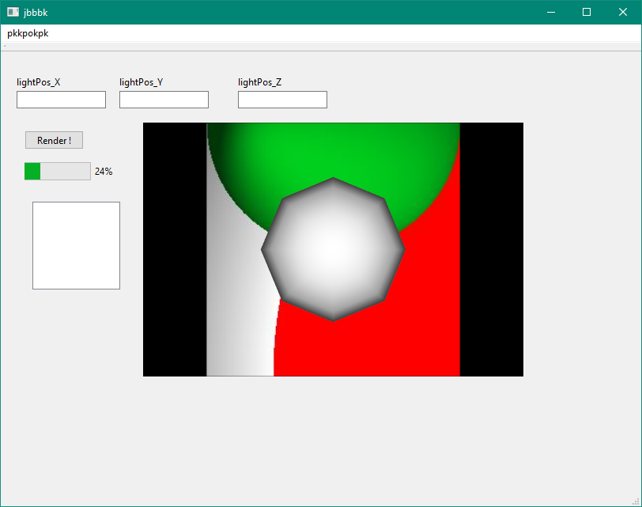

# TDD_Raytracer
TDD approach to implement a Raytracer (based on Prag Prog book)

pregenerated ppm of phong shaded, raytraced sphere (green object) used as a background for visualizing a vectorfield resembling the lightsource projection on the x-y-plane. input data for vectorfield visualization is generated with Arrowglyphs from filtered / masked (vtkMaskPoints). all integrated in Qt GUI. GUI is now capable of simulating a preview of the raytraced sphere. taking into account the sphere position and color set by the user.
screenshot reflects state of the raytracer july 2023 