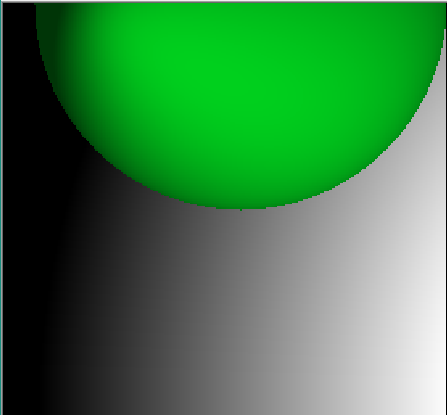

# TDD_Raytracer
TDD approach to implement a Raytracer (based on Prag Prog book)

phong shaded sphere with a background that simulates a point lightsource with uniform lightdistribution. the intensitiy of the background color decresases with distance from the lightsource to emphasize the shadows / diffuse reflection on the spheres surface. this is not how the lightsource really affects the calculation of the surface color!
screenshot reflects state of the raytracer may 2023 
