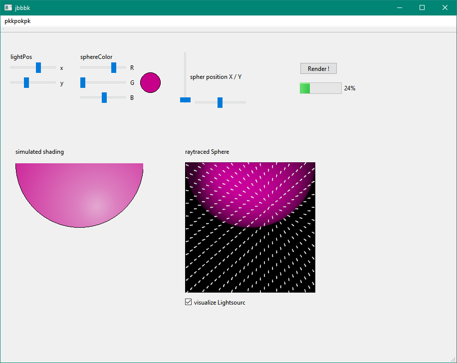

# TDD_Raytracer
TDD approach to implement a Raytracer (based on Prag Prog book)

phong shaded, raytraced sphere (green object) used as a background for vectorfield visualization. vectorfield overlay is created from rgb-values in vectorfield.ppm. input data for vectorfield visualization is generated with Arrowglyphs from filtered / masked (vtkMaskPoints) vectorfield.ppm. all integrated in Qt GUI.
screenshot reflects state of the raytracer june 2023 
